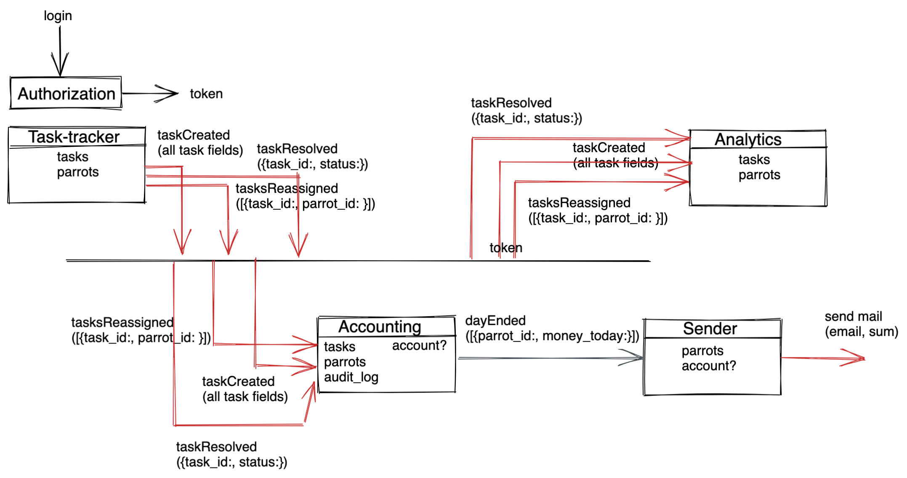

# Два основных пути:
  - разбиение по доменам -> авторизация, таск-трекер, аккаунтинг, аналитика, сендер (емейл)  
    
    **Проблемы:**
      - Изменения в сервисе аффектят сразу все роли  
    
    **Независимость:**
      - Доменов друг от друга - изменение механизма ассайна или подсчета прибылей не затронет аналитику
  - разбиение по бизнес-цепочкам = разбиение по ролям -> авторизация, обычный попуг, менеджер, бухгалтер, админ, сендер  
    **Проблемы:**
      - При новой роли новый сервис с набором классов на борту
      - Если упадет сервис - парализована работа всей роли, не сможет заходить и смотреть аналитику, если упал трекер  
    
    **Независимость:**
      - Функционалы для разных ролей - можно менять и деплоить дашборды без затрагивания других ролей

// Важно понимать, что я пытаюсь разделить сервисы по SRP, а надо делить как-то по-другому. Например, в ДДД - начать с одного
ограниченного контекста)

// Бизнес-кейсы - попытался разделить, но получилось разбиение по ролям. Как соотносить бизнес-кейс с ролями - игнорить?

# Базы:
  - обращение к одной базе одного сервиса всеми  
    **Минусы:**
      - Узкое горлышко - падает один сервис/база, падают остальные сервисы
      - То же самое с деплоем - удалил поле - остальные сервисы должны редеплоиться  
    
    **Плюсы:**
      - Нет дублирования данных
  - разные базы для сервисов с синком данных между ними  
    **Минусы:**
      - Дублирование данных
      - Нагрузка на сеть данными
      - Необходимость поддержки консистентности  
    
    **Плюсы:**
      - Сервисы автономны и могут изменяться с разной скоростью разными циклами - что нам и надо

# Первоначальная схема:

# Замечания:
  - Защититься от того, что кнопка реассайна тыкается кучу раз - в идеале отменять долгие синки в базу при приходе 
    нового ивента о реассайне. Мб прям сохранять процесс и убивать его?
  - Потери сообщения - нужен ли механизм повторения или достаточно месседж брокера (Rabbit)?
  - Что со счетами и аудит-логами? Можно высчитывать прибыли по аудит-логам попугов, можно создать отдельный общий и 
    считать в момент реассайна.
  - Так же и в аналитике - можно синкать сразу, можно пересчитывать по запросу
  - Посылать большие ивенты типа реассайна можно батчами
  - Чем занимается Sender? Если просто шлет письма - это можно делать и из аккаунтинга. На всякий случай сделал отдельный 
    сервис - но только ради тренировки и курса.
