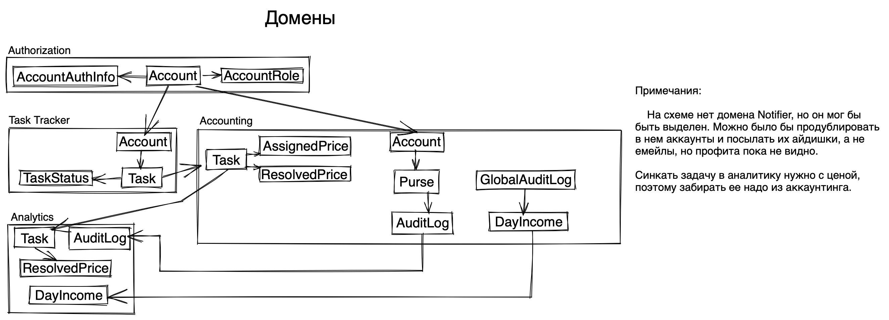
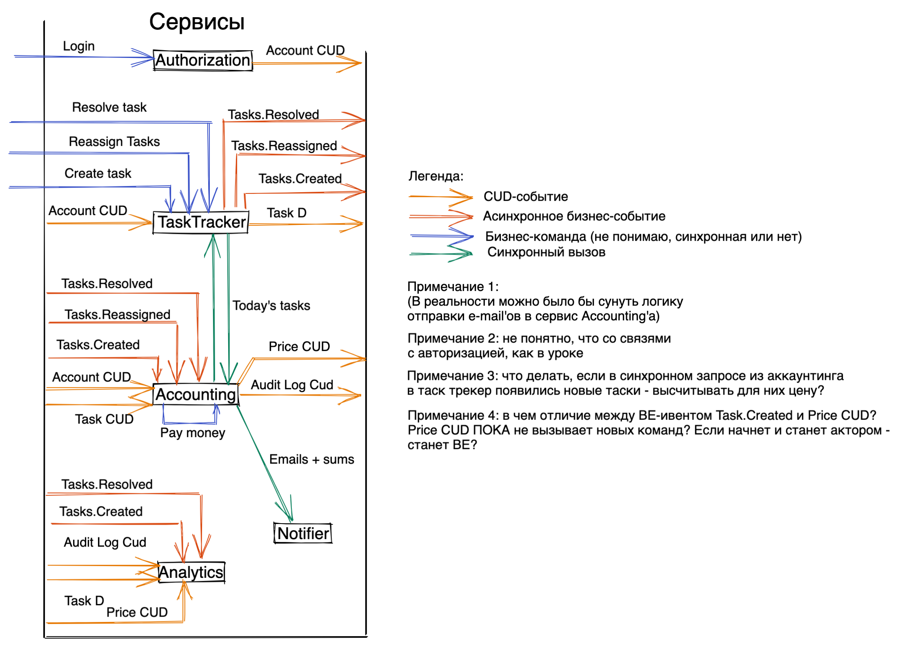

# EventStorming
Смотри соответсвующий .yml файл для обзора команд.

Цепочки:
  Log in (?)
  Register Account
  Change Account Role
  Add Task              -> Assign Task -> Register debit Transaction
  Change Task Assigners -> Assign Task -> Register debit Transaction
  Resolve Task -> Register credit Transaction
  Close Billing Cycles -> Send email
                       -> Make Payment
CUD-привязки:
  Tasks.Created -> Set Prices
  Transaction(Work).Created -> Update Balance (?)
                            -> Update Managers Income (?)
Read models:
  Count Debited Accounts
  Count the most Expensive Task

# Модель данных + домены

# Сервисы + коммуникации

