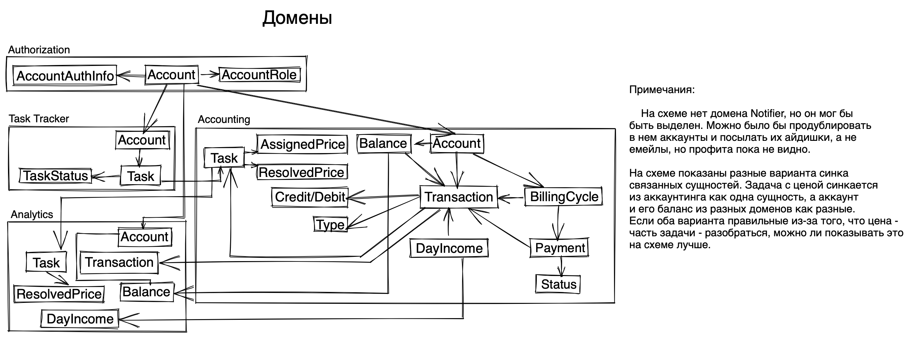

# EventStorming
Смотри соответсвующий .yml файл для обзора команд.

Цепочки:
  Log in
  Create Task -> Set Price
  Reassign Task -> Debit -> Log Purse change -> Update Managers Income
  Resolve Task -> Credit -> Log Purse change -> Update Managers Income
  Clear Purse -> Send email
              -> Log account credit
  Count Debited Accounts
  Count the most Expensive Task

# Модель данных + домены

# Сервисы + коммуникации

