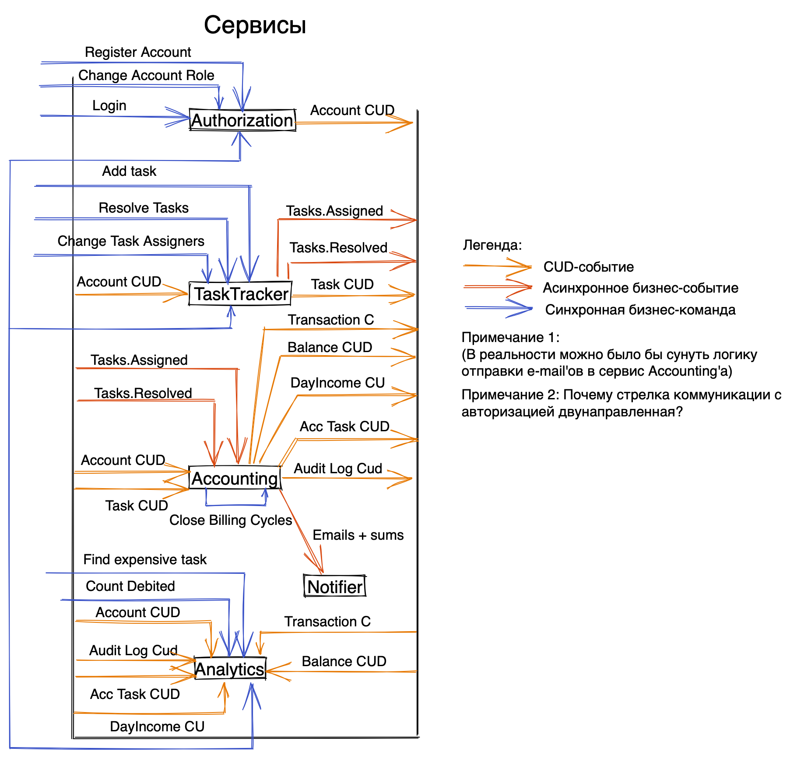

# EventStorming-команды
Смотри соответсвующий .yml файл.

Цепочки:  
  - Account:  
    - Account.Logined  
    - Tasks.Created -> Price.Set  
      Tasks.Created   -> Fee.Set
  - Manager/Admin:
    - Tasks.Reassigned -> Money.Writed-off -> AuditLog.Write-offLogged
    - (Command) Show Income
  - Developer:
    - Tasks.Resolved -> Money.Charged -> AuditLog.ChargedLogged
  - Cron:
    - Money.Paid -> Wallet.Cleared -> AuditLog.PaymentLogged  
      Money.Paid          -> Email.PaymentInfoSent
  - Admin:
    - (Command) Show Income
    - (Command) Show the most expensive task

# Домены

# Сервисы

